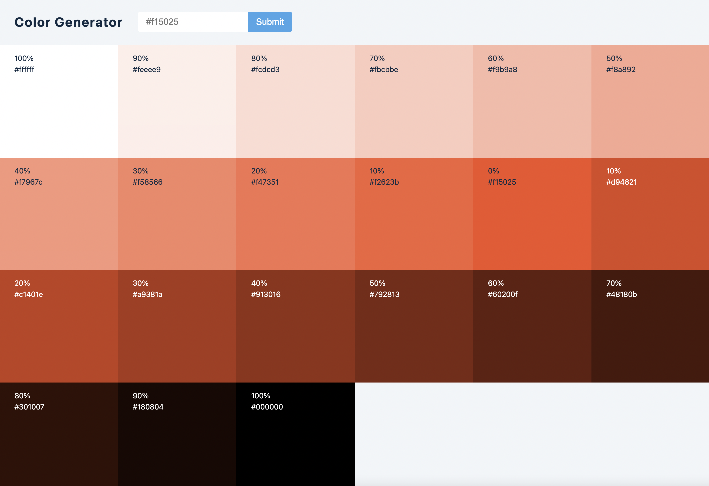

# Color Generator React

To start project

1. Download or clone git repository

2. Install dependencies `npm install`

3. Start server `npm start`

---

Completed [project](https://color-generator-react-by-malina.netlify.app/)

---

#### Screenshots

#### Values JS

[values.js](https://github.com/noeldelgado/values.js)
